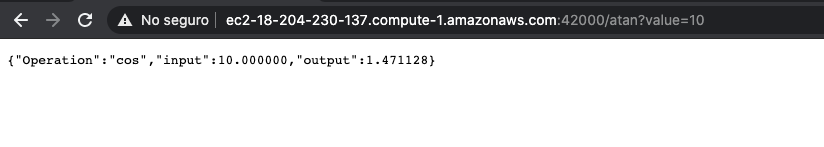
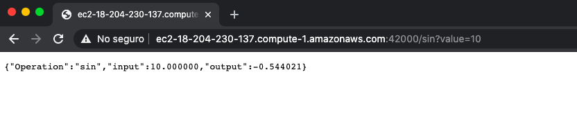

# Parcial Segundo Tercio AREP
## Autor: Johan Stiven Guerrero Pineda

En este parcial se construira una microcomponente el cual generara funciones del seno y arcotangente usando EC2 y Docker

### Prerequisites

* [Docker](https://www.docker.com/) - Container Manager
* [Maven](https://maven.apache.org/) - Dependency Management
* [Java 8](https://www.oracle.com/co/java/technologies/javase/javase-jdk8-downloads.html) -  Development Environment 
* [Git](https://git-scm.com/) - Version Control System
* [Spark](http://sparkjava.com/) - Micro framework for creating web applications in Java 8

## Servicios Que Ofrece

- /atan, endpoint correspondiente a la arcotangente de un valor
- /sin, endpoint correspondiente al seno de un valor

## Compilación
- Clonar el repositorio
```
git clone https://github.com/Johannes26/Parcial-AREP2
``` 
- Para compilar
```
mvn clean install
```
- Para usar la aplicacion desplegada en AWS ir al siguiente enlace
```
http://ec2-18-204-230-137.compute-1.amazonaws.com:42000/
```

## Pantallazos de Ejecución
### Función ArcoTangente


### Función Seno

